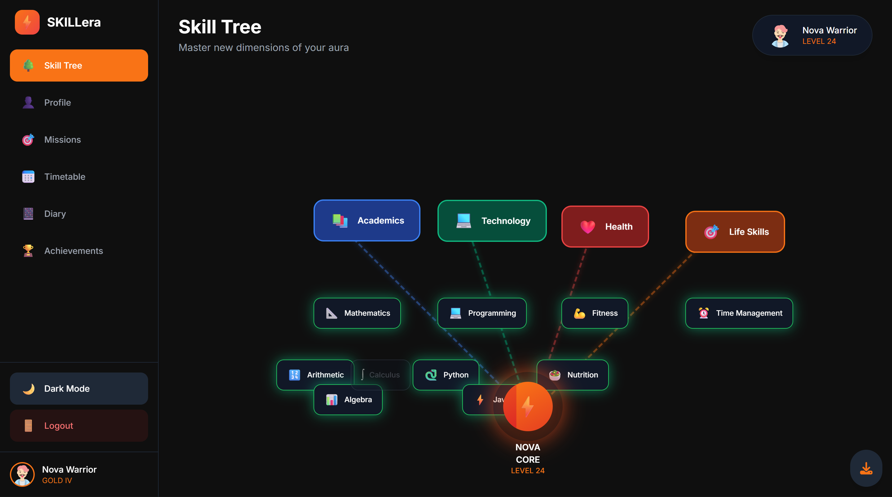
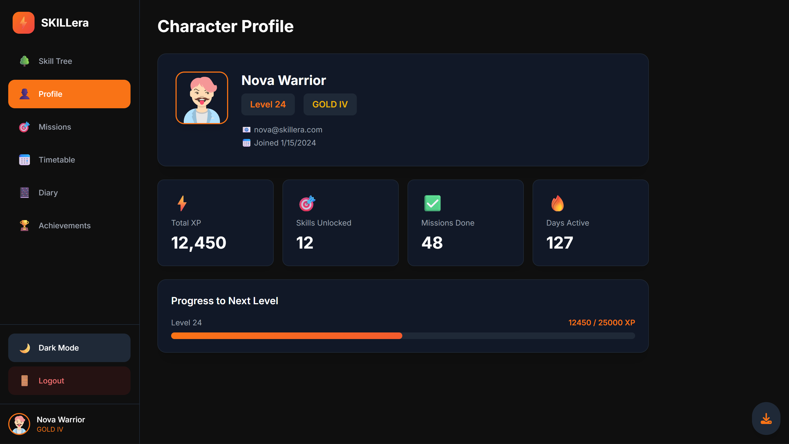
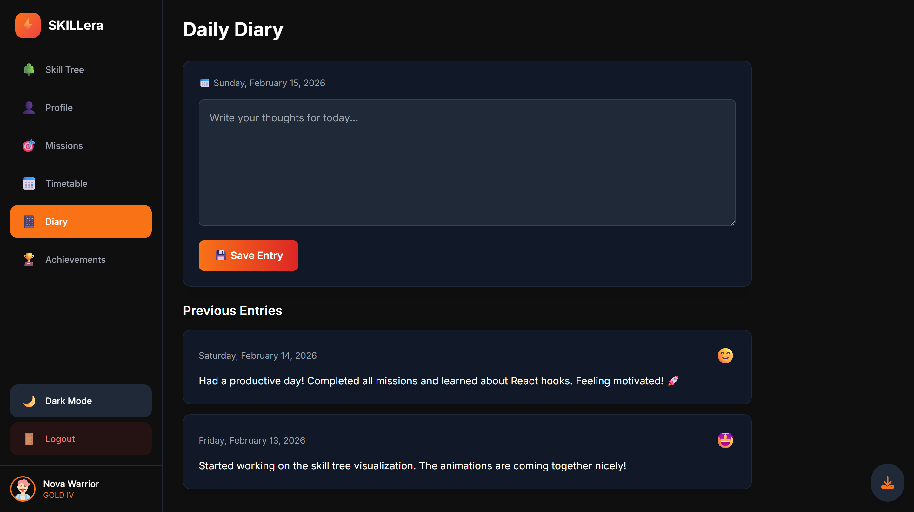
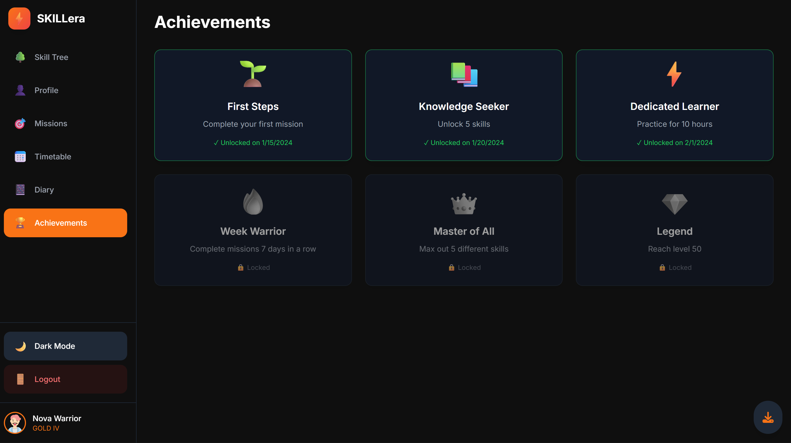
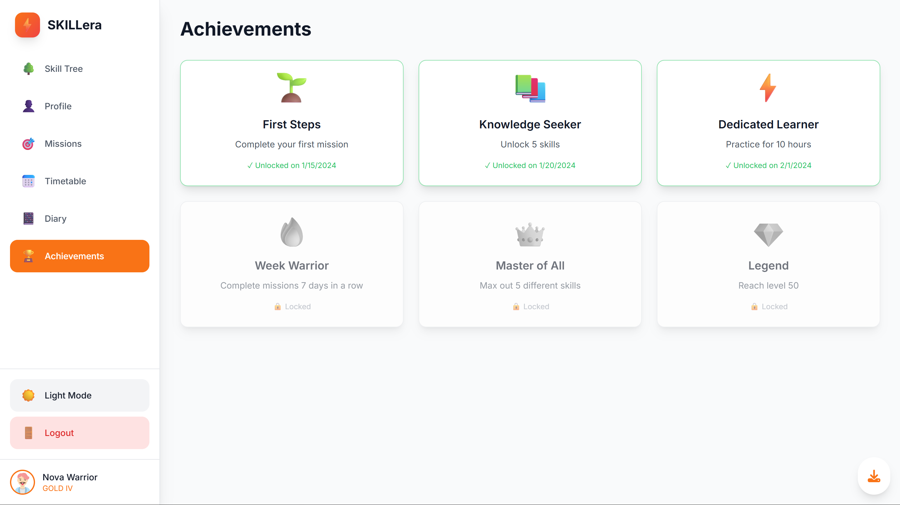

# 🎮 SKILLera - Level Up Your Life

<div align="center">


**A gamified student productivity and lifestyle management platform**

[Features](#-features) • [Screenshots](#-screenshots) • [Installation](#-installation) • [Tech Stack](#-tech-stack) 

</div>

---

## 📖 About

SKILLera (Abhigyan 4.0) is an innovative web-based assistant designed to transform student productivity and healthy living habits through engaging gamification. Track your progress across academics, technology, health, and life skills while earning XP, unlocking achievements, and leveling up your real-life character!

### 🎯 Project Theme
**Open Innovation (Education & Lifestyle)**

---

## ✨ Features

### 🌳 Interactive Skill Tree
- Visual progression system with animated nodes
- 4 main categories: Academics, Technology, Health, Life Skills
- Unlock and level up skills (Level 1-5)
- Real-time XP tracking and progress visualization
- Beautiful glowing effects and animations

### 🎯 Daily Missions System
- 7+ daily missions across all categories
- Click to mark complete
- Instant XP rewards
- Progress tracking with visual indicators
- Mission completion statistics

### 👤 Character Profile
- Personal avatar and stats
- Level and rank display (Bronze → Silver → Gold → Platinum → Diamond)
- Total XP counter
- Skills unlocked tracker
- Join date and activity metrics

### 📅 Daily Timetable
- Hour-by-hour schedule management
- Color-coded activities
- Duration indicators
- Reminder notifications
- Professional layout

### 📔 Daily Diary
- Write and save daily entries
- Mood tracking with emojis
- View entry history
- Auto-save to local storage
- Beautiful card-based design

### 🏆 Achievements System
- 6+ unique achievements
- Locked/Unlocked states
- Unlock dates tracking
- Rarity indicators
- Progress requirements

### 🎨 Additional Features
- **🌙 Dark/Light Theme Toggle** - Switch between beautiful themes
- **📱 Fully Responsive** - Works on desktop, tablet, and mobile
- **💾 Data Persistence** - All progress saved to browser
- **📥 Export Data** - Download complete backup as JSON
- **🔐 Login System** - Sign up, login, or continue as guest
- **⚡ Smooth Animations** - Professional transitions and effects

---

## 📸 Screenshots

### 🌳 Skill Tree - Interactive Progress Visualization

*Track your progress across 4 main skill categories with beautiful animations*

---

### 👤 Character Profile - Your Stats Dashboard

*View your level, rank, XP, and overall progress at a glance*

---

### 🎯 Daily Missions - Gamified Task Management

*Complete daily missions to earn XP and level up*

---

### 📅 Daily Timetable - Schedule Your Day

*Organize your day with color-coded time blocks*

---

### 📔 Daily Diary - Journal Your Journey

*Record your thoughts, track moods, and reflect on your progress*

---

### 🏆 Achievements - Unlock Your Potential

*Earn achievements for reaching milestones and completing challenges*

---

### ☀️ Light Mode - Beautiful Day Theme

*Toggle between dark and light themes for comfortable viewing anytime*

---

## 🚀 Installation

### Option 1: Simple (No Installation)
1. Download `SKILLera-FINAL-ULTIMATE.html`
2. Double-click to open in any modern browser
3. Start using immediately! 🎉

### Option 2: Full Development Setup

```bash
# Clone the repository
git clone https://github.com/yourusername/skillera.git
cd skillera

# Install dependencies
npm install

# Start development server
npm run dev

# Build for production
npm run build
```

---

## 💻 Tech Stack


-used figma for ui and ux
-used claude 

---

## 🎮 How to Use

### Getting Started
1. **Login** - Create an account or continue as guest
2. **Explore Skill Tree** - Click on skills to view details
3. **Complete Missions** - Check off daily tasks to earn XP
4. **Track Progress** - Watch your level and XP grow
5. **Customize Theme** - Toggle dark/light mode
6. **Export Data** - Download your progress anytime

### Tips for Maximum Productivity
- ✅ Complete all daily missions for maximum XP
- 📊 Focus on one skill category at a time
- 📔 Write in diary daily for self-reflection
- 🎯 Set realistic timetable goals
- 🏆 Aim for achievements to stay motivated

---


## 📊 Project Statistics

```

🎨 UI Components: 48
✨ Animations: 20+
📱 Pages: 6
🎯 Features: 15+
```

---

## 🤝 Contributing

Contributions are welcome! Here's how you can help:

1. Fork the repository
2. Create your feature branch (`git checkout -b feature/AmazingFeature`)
3. Commit your changes (`git commit -m 'Add some AmazingFeature'`)
4. Push to the branch (`git push origin feature/AmazingFeature`)
5. Open a Pull Request

---

## 📄 License

This project is licensed under the MIT License - see the [LICENSE](LICENSE) file for details.

---

## 👨‍💻 Author

**Abhigyan Team**
- Project: Team OkOk - SKILLera
- Theme: Open Innovation (Education & Lifestyle)

---

## 🙏 Acknowledgments

- Icons from [Lucide React](https://lucide.dev/)
- UI Components from [shadcn/ui](https://ui.shadcn.com/)
- Design inspiration from modern productivity apps
- Community feedback and support

---

## 📞 Support

If you like this project, please ⭐ star it on GitHub!

For questions or support:
- 📧 Email: viyushsingh@gmail.com
- 💬 Issues: [GitHub Issues](https://github.com/yourusername/skillera/issues)

---

<div align="center">

**Made with ❤️ for students who want to level up their lives**


</div>

---


## 🎓 Educational Value

SKILLera helps students:
- 📈 Track academic progress visually
- 🎯 Build consistent study habits
- 💪 Maintain healthy lifestyle
- ⏰ Manage time effectively
- 🏆 Stay motivated through gamification
- 📊 Measure personal growth

---

## 🌟 Star History

If you find this project useful, please consider giving it a ⭐!

---

## 📱 Screenshots Gallery

<details>
<summary>Click to view all screenshots</summary>

### Dark Theme
- 
- 
- 
- 
- 
- 

### Light Theme
- 

</details>

---


